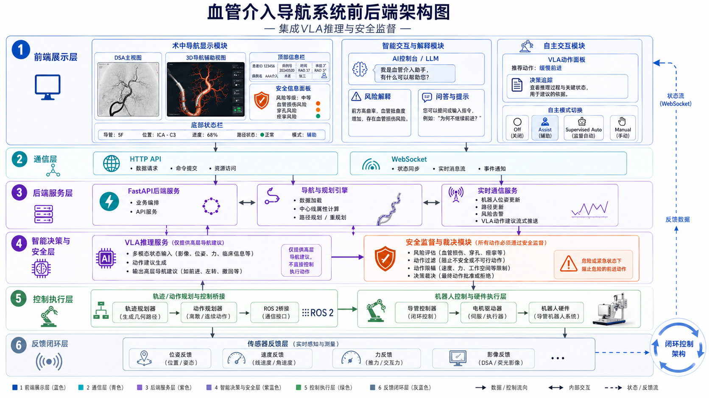
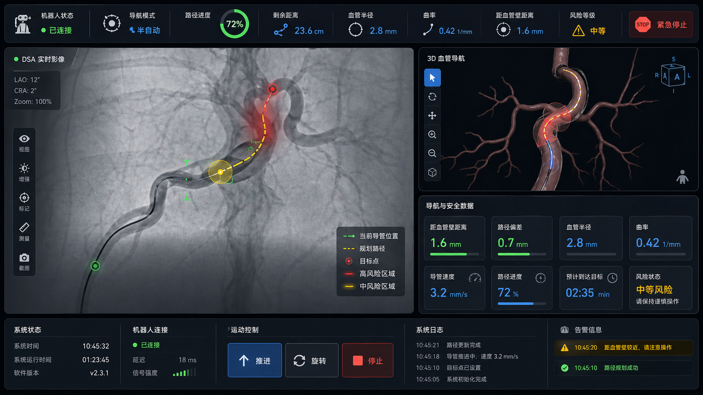
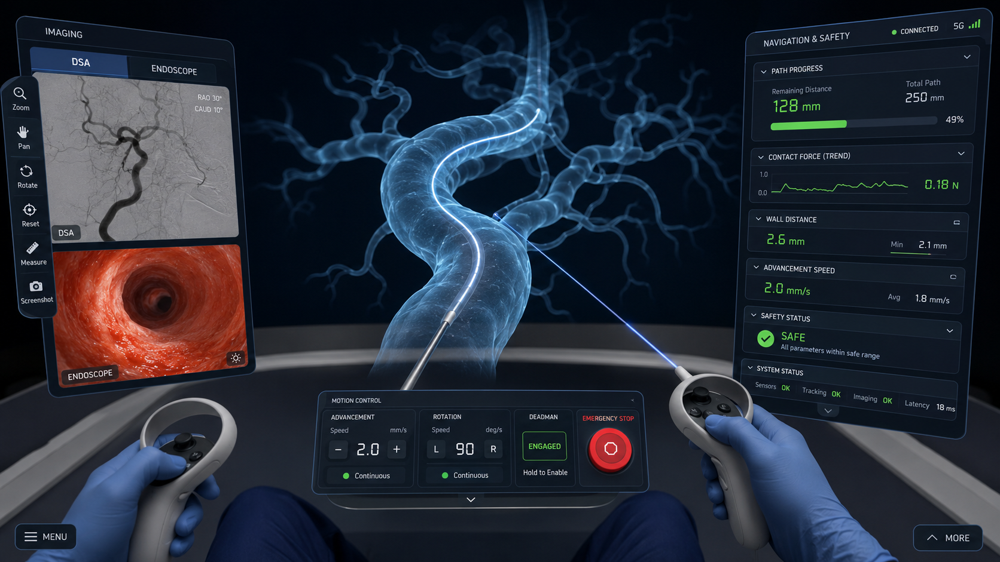

# CathSim 血管介入仿真与智能导航平台

CathSim 是面向血管介入导丝/导管导航研究的数字孪生仿真平台，覆盖血管资产与路径规划、Newton/MuJoCo 物理仿真、ShapeIntent 控制、FastAPI/WebSocket 服务、Godot 医疗导航工作站，以及 Gymnasium + Stable-Baselines3 训练与评估。

> 文档基线：2026-08-04
> 当前阶段：**主链路可运行，训练闭环和 PICO XR 客户端持续开发，物理真实性仍在迭代增强。**
> 使用边界：本项目用于科研仿真、教学和人机交互实验，不构成真实临床控制系统、医疗器械认证或临床操作指南。

## 项目状态

| 子系统 | 当前状态 | 已有能力 | 主要边界 |
|---|---|---|---|
| 资产与路径规划 | 已验证 | VPP/内置 phantom、中心线图、A*、B-spline、半径感知路线与质量报告 | 部分旧 phantom 仍缺完整 centerline/radius/routes |
| 后端服务 | 已验证 | FastAPI、REST、WebSocket、session、`navigation_visual_v3`、急停锁存与恢复 | 部署实例和协议版本仍需按发布批次固定 |
| 物理仿真 | 可运行、持续增强 | Newton GPU 导丝、变半径厚壁 SDF、MuJoCo 对照、guided 可达性模式 | 完整器械级分段、真实力/扭矩来源和跨病例标定未全部完成 |
| 桌面医疗工作站 | 核心功能已实现 | DSA/腔镜/3D 导航布局、风险与安全状态、控制门控、相机与回放基础 | DSA 是占位/模拟输入；不代表真实机器人已连接 |
| 强化学习 | 工程骨架已验证 | `NavigationGymEnv`、ShapeIntent/direct 动作、PPO/SAC 训练与评估入口 | 正式轨迹记录器、BC 数据转换、成规模数据与泛化证据待补齐 |
| PICO 4 Ultra XR | 开发中 | Godot 4.7/OpenXR 工程、XR 输入快照、零控制 SafetyGate、Android 导出边界 | Debug APK 构建/静态审计已通过；build-ready 判定和真机验收尚未完成 |
| 真实临床/机器人控制 | 不在当前范围 | 仿真协议与安全研究接口 | 无真实患者数据流、真实硬件急停或临床控制授权 |

状态判断以代码、自动化测试、指定硬件验收记录和最新进度文档共同为准；设计方案中的目标、界面概念或实验参数不自动等同于已实现能力。

## 总体架构



*目标架构概念图：展示层、通信层、后端服务、智能策略与安全监督、控制执行及反馈闭环。图中的 VLA/自主交互属于演进方向，当前稳定控制主线仍是 ShapeIntent → Controller → push/rotate → PhysicsEngine。*

### 分层架构

```text
┌────────────────────────────────────┐     ┌─────────────────────────────────┐
│ Godot HCI / PICO XR 交互入口       │     │ RL Policy / PPO / SAC 训练入口  │
│ 桌面 UI / 3D / 腔镜 / HUD          │     │ headless train / evaluate       │
│ OpenXR / Deadman / SafetyGate      │     │ Dict observation / ShapeIntent  │
└──────────────────┬─────────────────┘     └────────────────┬────────────────┘
                   │ WebSocket / REST                       │ Gymnasium API
                   ▼                                        ▼
┌────────────────────────────────────┐     ┌─────────────────────────────────┐
│ FastAPI 平台服务适配层             │     │ NavigationGym 训练适配层        │
│ SessionManager / WebSocketHandler  │     │ reset / step / reward / done    │
│ Path API / Health / Recording      │     │ PPO/SAC callback / checkpoint   │
│ 急停锁存 / 恢复 / 状态批次         │     │ 进程内复用，无需 WebSocket      │
└──────────────────┬─────────────────┘     └────────────────┬────────────────┘
                   └────────────────────────┬───────────────┘
                                            ▼
┌────────────────────────────────────────────────────────────────────────────┐
│                           共享核心 Shared Core                              │
│  PathPlanner            graph A* / route switching / B-spline / radii      │
│  ShapeIntentController  target direction / waypoint / intensity            │
│                         → push / rotate                                     │
│  NavigationEngine       progress / deviation / curvature / mechanics       │
│  Safety & Risk          safety status / risk / control gate / flow guidance│
└───────────────────────────────┬────────────────────────────────────────────┘
                                ▼
┌────────────────────────────────────────────────────────────────────────────┐
│                         PhysicsEngine 抽象层                                │
│  KinematicEngine  guided 演示与可达性验证                                  │
│  MuJoCoEngine     原始 CathSim 兼容与物理对照                              │
│  NewtonEngine     当前 GPU 高保真主线：导丝、SDF 腔碰撞、分段与支撑诊断     │
└───────────────────────────────┬────────────────────────────────────────────┘
                                ▼
┌────────────────────────────────────────────────────────────────────────────┐
│                           数据、资产与证据层                                │
│  VPP / 3D Slicer / VMTK → centerline / graph / routes / radius             │
│  STL/GLB 视觉资产 | SDF/厚壁环管碰撞资产 | session/trajectory/评估报告      │
└────────────────────────────────────────────────────────────────────────────┘
```

其中 HCI/XR 通过 FastAPI 实时服务进入共享核心；RL 训练为提高采样效率，可在 Python 进程内直接复用 `NavigationEngine`、`ShapeIntentController` 和 `PhysicsEngine`，不要求经过 WebSocket。两条入口最终必须遵守相同的动作、安全和保真度语义。

### 核心数据流

```text
血管影像 / STL / VTK / 中心线 / 半径
                    │
                    ▼
         资产转换与 PathPlanner
       graph + A* + B-spline + routes
                    │
         ┌──────────┴──────────┐
         ▼                     ▼
Godot HCI / PICO XR      NavigationGym + PPO/SAC
         │                     │
         └──────────┬──────────┘
                    ▼
        ShapeIntentController
             push / rotate
                    │
                    ▼
 NavigationEngine + Safety/Risk
                    │
                    ▼
 PhysicsEngine: Newton / MuJoCo / Kinematic
                    │
                    ▼
 navigation_visual_v3 / session recording / evaluation
```

### 模块职责

| 层级 | 主要模块 | 职责与边界 |
|---|---|---|
| 桌面交互 | `godot_client/scenes/main.tscn`、`main_controller.gd`、HUD/UI | 医疗工作站显示、键鼠/点击输入、导丝/血管/路径渲染和状态反馈 |
| XR 交互 | `MainXR.tscn`、XR input snapshot、`SafetyGate` | OpenXR 生命周期、空间 UI、手柄输入与客户端同周期归零；当前仍处安全骨架阶段 |
| 平台服务 | `services/main.py`、`websocket_handler.py`、`session_manager.py` | REST/WebSocket、实时会话、状态批次、路径请求、急停锁存与恢复 |
| 训练适配 | `src/cathsim/gym/envs/navigation.py`、`navigation_train.py` | 将共享核心包装为 Gymnasium 环境，管理 observation、action、reward、episode 和训练产物 |
| 路径规划 | `services/path_planner.py`、graph/routes/radius 资产 | A*、路线切换、B-spline 平滑、路径半径和质量验证 |
| 控制抽象 | `services/shape_intent.py`、`physics_autopilot.py` | 将 Human/RL 的方向、路点与强度意图解算为底层 `push/rotate` |
| 导航编排 | `services/navigation_engine.py` | 汇总物理、路径、进度、偏差、曲率、器械诊断、风险与流程状态 |
| 安全与风险 | `risk_assessor.py`、控制门控、`flow_guidance` | 产生后端权威安全状态、风险原因和流程建议；不允许前端补造 |
| 物理抽象 | `services/physics/` | 在统一接口后提供 Newton、MuJoCo 与 Kinematic 实现并声明保真度 |
| 数据与证据 | `data/`、`tools/`、session/trajectory/report | 管理病例、视觉/碰撞资产、训练记录、质量报告和验收证据 |

核心原则：

- HCI 与 RL 共用路径、状态、控制抽象和物理接口，避免维护两套行为语义。
- 策略或用户只提交高层意图或 `push/rotate`，不得直接改写导丝节点位置。
- `guided` 只用于演示和可达性验证，不能冒充 Newton 物理结果。
- 风险、安全、力和设备状态必须可追溯到真实后端字段；缺失时显示 `unknown`、`stale` 或 `null`。
- 渲染资产与碰撞/SDF 资产分离，视觉效果不能改变物理或医学语义。

## 快速开始

### 1. 环境准备

基础开发环境：

- Python 3.10+
- Windows PowerShell（当前主要开发环境）
- Godot 4.7.x（桌面与 XR 项目基线）
- 可选：Newton/Warp GPU 环境、PICO 4 Ultra Enterprise 与 Android 工具链

```powershell
python -m venv .venv
..venv\Scripts\Activate.ps1
python -m pip install --upgrade pip
python -m pip install -e .
```

`pyproject.toml` 是 Python 依赖版本的当前入口。Newton/Warp、Android 和 PICO 环境需要额外配置，分别参见后端物理与 XR 文档。

### 2. 启动后端

推荐先使用与 Godot 默认配置一致的 `9000` 端口：

```powershell
$env:CATHSIM_PORT="9000"
python -m services.main
```

验证服务：

```powershell
Invoke-RestMethod http://127.0.0.1:9000/api/v1/health
```

启动后可访问：

- OpenAPI：`http://127.0.0.1:9000/docs`
- REST：`http://127.0.0.1:9000/api/v1/...`
- WebSocket：`ws://127.0.0.1:9000/ws/session`

`start_backend.bat` 为避免本机端口冲突默认使用 `9001`，而 Godot 默认连接 `9000`。若使用批处理脚本，应显式统一两端：

```powershell
# 终端 1
$env:CATHSIM_PORT="9001"
.start_backend.bat

# 终端 2
$env:CATHSIM_SERVER_URL="ws://127.0.0.1:9001/ws/session"
.start_godot.bat
```

### 3. 启动 Godot 桌面客户端

```powershell
.start_godot.bat
```

也可以使用 Godot 4.7 打开 `godot_client/project.godot` 后按 F5。桌面入口是 `res://scenes/main.tscn`，Android/XR 构建使用 `res://scenes/xr/MainXR.tscn`。

### 4. 运行核心回归

```powershell
python -m pytest `
  tests/test_services_api.py `
  tests/test_navigation_gym_env.py `
  tests/test_navigation_train.py `
  tests/test_frontend_contract.py `
  tests/test_xr_sprint0_contract.py -q
```

完整测试集包含需要可选资产、MuJoCo、Newton/Warp、Godot 或真机环境的测试，运行前应先确认对应依赖。

## 运行模式与保真度

| 模式 | 实现 | 用途 | 不可声称的能力 |
|---|---|---|---|
| `newton` / `newton_demo` | `NewtonEngine` | 当前 GPU 高保真主线、SDF 碰撞、导丝力学与训练 | 未标定场景不能直接外推为临床真实性 |
| `mujoco` / `physics` | `MuJoCoEngine` | 原始 CathSim 兼容、回归与物理对照 | 不代表当前 Newton 主线结果 |
| `guided` / `kinematic` | `KinematicEngine` | 中心线循路演示、可达性和前端验证 | 不产生完整真实接触/屈曲语义，不得混入物理训练数据 |
| `rl` | NavigationGym + policy | 进程内训练或策略推理的上层模式 | 仍必须明确底层实际使用的物理引擎和安全门控 |

会话可通过 `physics_engine` 显式选择后端，也可用 `CATHSIM_PHYSICS_ENGINE` 配置。客户端和实验记录必须保存 `engine`、`fidelity_mode`、phantom、route、代码版本和物理参数。

## 资产与路径规划

主要资产来源：

- CathSim 内置 phantom：`src/cathsim/dm/components/phantom_assets/`
- VPP 外部病例：`data/vpp_assets/<case_id>/`
- Godot 视觉资产：`godot_client/assets/models/`
- 路径与质量工具：`tools/`

当前代表性基线：

| 资产 | 当前用途 | 状态说明 |
|---|---|---|
| `aorta_tree` | Newton 主场景、18 条 endpoint route、训练 curriculum | 内置多路线主资产 |
| `aorta_trunk` | 单路线与低难度基线 | 适合物理/控制对照 |
| `segment_part` | 中心线图、分支规划与 wrong-branch/recovery 研究 | 复杂图质量仍需持续验收 |
| `case_001` | VPP 外部病例、25 条可达路线、半径感知规划 | `endpoints_24/25` 应按特殊路线处理 |

VPP 资产校验与视觉导出示例：

```powershell
python tools/validate_vpp_assets.py data/vpp_assets/case_001
python tools/export_godot_assets.py --case-id case_001 --quality visual_high
python tools/build_route_quality_report.py data/vpp_assets/case_001 --no-smooth
```

## 后端、协议与安全

后端入口为 `services/main.py`。主要接口：

| 类型 | 路径/消息 | 用途 |
|---|---|---|
| REST | `GET /api/v1/health` | 服务健康检查 |
| REST | `GET /api/v1/assets/cases` | 病例/资产清单 |
| REST | `POST /api/v1/path/plan` | 路径规划 |
| REST | `/api/v1/session/...` | 会话创建、查询、步进、重置和删除 |
| WebSocket | `/ws/session` | 实时控制、状态批次、路径切换、急停与恢复 |

前后端统一使用 `navigation_visual_v3`。关键消息包括：

- 客户端到服务端：`session_start`、`control`、`shape_intent`、`path_request`、`select_route`、`reset`、`emergency_stop`、`resume`。
- 服务端到客户端：`session_started`、`state_update`、`state_batch`、`path_response`、`control_rejected` 和急停/恢复确认。

安全结论由后端权威状态产生。前端可以做同周期归零、数据新鲜度和控制权限门控，但不得依据屏幕颜色或局部曲率重新推导一套安全状态。

## Godot 医疗导航前端



*桌面工作站设计：DSA 影像区、3D 血管导航、导航与安全数据、运动控制和告警。当前 DSA 内容属于占位/模拟边界，3D 血管、路径、导丝和安全数据由项目资产及后端状态驱动。*

桌面端当前包含：

- 顶部系统、模式、进度、半径、曲率、壁距、风险和急停状态；
- DSA、动态腔镜和 3D 玻璃血管导航视图；
- 路径、目标、导丝、风险/安全状态与导航相机；
- 手动控制、点击导航、自动控制、急停锁存/恢复和会话重连；
- 深色医疗工业风 UI，以及真实数据缺失时的 stale/unknown 显示。

程序化腔镜材质用于增强仿真可读性，不是患者真实黏膜纹理或诊断影像。

## PICO 4 Ultra Enterprise XR



*XR 目标构图：中央血管与导丝、左侧双影像、右侧安全导航面板、下方控制坞和双手柄交互。该图是产品与视觉基准，不是当前完成度截图。*

技术基线：Godot 4.7.1、OpenXR 1.1、匹配的 Vendors Plugin、PICO OpenXR Runtime、Android arm64 APK。

当前仓库已建立桌面/XR 双入口、只读 XR 输入快照、零控制 SafetyGate、PICO profile 和 Android 导出边界。M1-R4 Debug APK 构建与静态审计已经通过；M1 build-ready 判定、APK 真机安装和功能/安全/性能验收仍按后续里程碑推进。

环境预检与 Debug APK 构建：

```powershell
.\scripts\check_android_env.ps1
.\scripts\build_android_pico_debug.ps1
.\scripts\audit_android_pico_apk.ps1
```

第一版明确不包含真实机器人控制、真实 DSA/腔镜硬件流、VR 内启动 RL 训练、MR 透视、多人协作、语音控制和手势连续操控。

## 强化学习训练

当前新主线：

```text
cathsim/NavigationGym-v0
  → NavigationGymEnv
  → NavigationEngine
  → ShapeIntentController
  → NewtonEngine / MuJoCoEngine / KinematicEngine
  → PPO 或 SAC
```

训练入口支持 `shape_intent` 与 `direct` 两种动作模式。推荐策略接口是四维 ShapeIntent：`[direction_x, direction_y, direction_z, intensity]`；`direct=[push, rotate]` 主要用于消融和可达性对照。

先运行环境与训练管线测试：

```powershell
python -m pytest tests/test_navigation_gym_env.py tests/test_navigation_train.py -q
python -m cathsim.rl.navigation_train --help
python -m cathsim.rl.navigation_evaluate --help
```

单路线 PPO 示例：

```powershell
python -m cathsim.rl.navigation_train `
  --algorithm ppo `
  --run-name stage0_endpoint0_seed0 `
  --phantom aorta_tree `
  --route-target endpoint_0 `
  --action-mode shape_intent `
  --physics-engine newton `
  --total-timesteps 100000 `
  --seed 0
```

训练结果不能只看累计奖励。至少同时报告成功率、终止原因、最终/最大进度、接触峰值与积分、碰撞/超时/错误分支、不同 seed 离散程度和未见几何表现。

当前旧 `src/cathsim/rl/train.py`、`bc.py` 和 `data.py` 保留为 MuJoCo/图像研究基线；在数据转换器和闭环测试完成前，不应把旧 BC 权重直接当作 NavigationGym + ShapeIntent 主线模型。

## 仓库结构

| 路径 | 职责 |
|---|---|
| `services/` | FastAPI、WebSocket、session、NavigationEngine、控制、安全和物理引擎 |
| `src/cathsim/` | Python 包、Gym 环境、RL 训练/评估与原始 CathSim 能力 |
| `godot_client/` | Godot 4.7 桌面与 Android/OpenXR 客户端 |
| `data/` | VPP 病例、中心线、路线、报告与实验数据 |
| `tools/` | 资产转换、路径质量、物理审计与部署工具 |
| `scripts/` | 启动、验证、Android/PICO 构建和辅助脚本 |
| `tests/` | 服务、物理、训练、前端契约与 XR 合同测试 |
| `doc/` | 按五层职责组织的中文设计、进度、验收和教程文档 |
| `docs/` | 网站文档与 XR 专项状态记录 |
| `artifacts/` | 可复现验收/构建产物目录 |

## 文档地图

README 只提供入口和当前边界，详细设计与历史证据以 `doc/` 为准。阅读优先级建议为：代码与测试 → 最新进度/交接 → 分层验收 → 专题方案 → 历史设计。

### 1. 整体设计

- [总体技术方案](doc/1.整体设计/01-总体技术方案.md)
- [资产与数据规格](doc/1.整体设计/02-资产与数据规格.md)
- [API 与通信协议](doc/1.整体设计/03-API与通信协议.md)
- [部署与开发指南](doc/1.整体设计/04-部署与开发指南.md)
- [开发进度记录](doc/1.整体设计/05-开发进度记录.md)
- [分层验收与开发规划](doc/1.整体设计/06-分层验收与开发规划.md)

### 2. 图像分割与路径规划

- [Segment_part 中心线图规划方案](doc/2.图像分割路径规划层/06-segment_part_graph规划方案.md)

### 3. 后端仿真

- [Newton 导丝物理仿真开发记录与规划](doc/3.后端仿真层/07-Newton导丝物理仿真开发记录与规划.md)
- [物理引擎抽象与实时性能架构](doc/3.后端仿真层/07-物理引擎抽象与实时性能架构.md)
- [Warp/XPBD/Newton 迁移与选型](doc/3.后端仿真层/08-导丝物理迁移技术方案-Warp-XPBD-Newton.md)
- [aorta_tree Newton 迁移 VPP 方案](<doc/3.后端仿真层/14-aorta_tree Newton物理引擎迁移VPP方案.md>)
- [后端 CI/CD 工作流设计（设计稿）](doc/3.后端仿真层/16-CathSim后端CI-CD工作流设计.md)
- [导丝分段连续体建模](doc/3.后端仿真层/导丝分段仿真建模与参数设定方案.md)
- [导丝器械与手术流程开发计划](doc/3.后端仿真层/导丝器械设计与手术流程设计开发计划.md)
- [大曲率转弯流程引导](doc/3.后端仿真层/介入导丝大曲率转弯流程引导设计方案.md)

### 4. Godot 桌面与 PICO XR 前端

- [医疗导航前端设计方案](doc/4.前端层/11-前端设计方案.md)
- [三维血管导航渲染方案](doc/4.前端层/12-三维血管导航渲染改造方案.md)
- [三维血管导航开发计划](doc/4.前端层/13-三维血管导航渲染开发计划.md)
- [三维血管导航改进版](doc/4.前端层/三维血管导航渲染改造方案_改进版.md)
- [前端开发交接文档](doc/4.前端层/前端开发交接文档_2026-07-23.md)
- [腔镜血管内壁渲染优化](doc/4.前端层/腔镜血管内壁渲染优化方案_2026-07-24.md)
- [PICO 4 Ultra Enterprise VR 设计方案](doc/4.前端层/PICO4_Ultra_Enterprise_VR前端设计方案.md)
- [PICO 4 Ultra Enterprise VR 开发规划](doc/4.前端层/PICO4_Ultra_Enterprise_VR前端开发规划.md)
- [PICO 4 Ultra Enterprise VR 验收方案](doc/4.前端层/PICO4_Ultra_Enterprise_VR前端验收方案.md)

### 5. HCI、训练与数据

- [ShapeIntent 控制层](doc/5.训练层/09-人机交互与强化学习架构-ShapeIntent.md)
- [HCI/RL 一体化平台设计](doc/5.训练层/10-介入手术人机交互与强化学习一体化平台设计.md)
- [强化学习训练设计方案](doc/5.训练层/11-强化学习训练设计方案.md)
- [自采数据训练方案与清单](doc/5.训练层/12-自采数据训练方案与数据收集清单.md)
- [自采数据操作员教程](doc/5.训练层/13-自采数据基础教程-操作员版.md)
- [介入导丝智能训练新手教程](doc/5.训练层/新手教程/README.md)
- [项目实战训练全过程](doc/5.训练层/新手教程/13-项目实战训练全过程.md)
- [强化学习自主导航实验设计](doc/5.训练层/新手教程/14.基于强化学习的介入导丝自主导航实验设计.md)

## 真实性与安全边界

- 本项目中的“设备就绪”表示仿真会话/引擎就绪，不表示真实机器人硬件已连接。
- DSA 首版为明确占位；腔镜来自本地三维仿真视图，不是硬件视频流。
- 程序化材质、玻璃血管和风险配色用于仿真可读性，不应解释为患者真实组织或诊断结论。
- `lateral_force_n`、`axial_force_n`、`torque_nm` 等没有可靠来源时必须保持空值，不能由前端补造。
- Guided、mock、占位数据和实验性 UI 必须明确标识，不得进入高保真训练或验收结论。
- 软件急停和 SafetyGate 是仿真安全机制，不替代真实设备的物理急停和法规流程。
- 模型训练与评估结论仅适用于记录的代码、资产、物理参数、硬件、seed 和测试病例。

## License 与贡献

项目采用 [LICENSE](LICENSE) 中的非商业许可条款。贡献前请阅读 [contributors.md](contributors.md)，并确保新增数据、模型和医学资产具有清晰来源、许可和去标识化记录。
