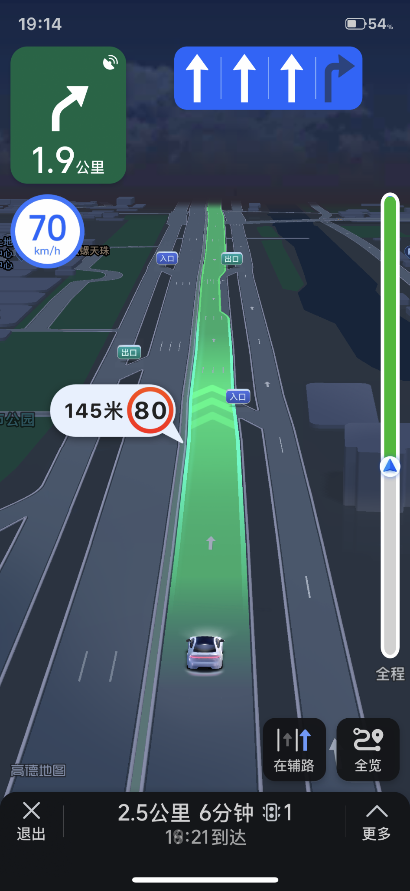
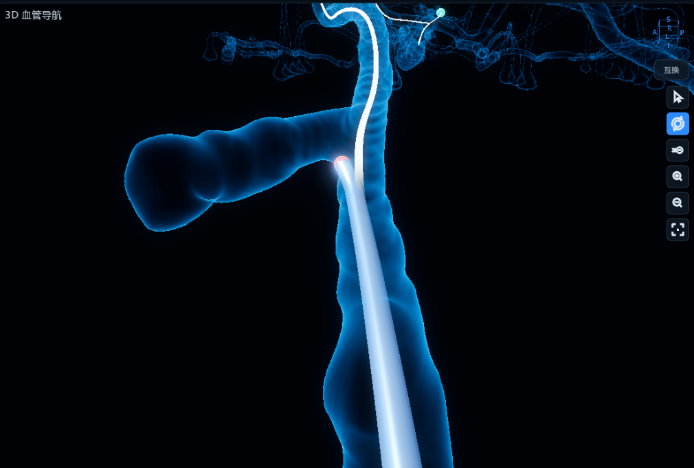
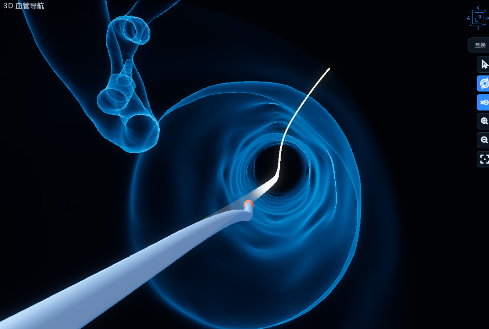

# 三维血管导航渲染改造方案

> 目标：把当前 Godot 3D 血管视图从“低模发光管道总览”升级为“医学影像式玻璃血管 + 车道级跟随导航 + 第一人称内窥镜导航”视图。本文覆盖血管建模、材质、相机、遮挡管理、路径引导、力学安全状态可视化与前后端数据契约。


## 参考视角与本轮新增目标

### 图 1：地图软件车道级导航参考



借鉴点不是复制地图 UI，而是采用其稳定的空间阅读方式：

- 当前行进方向始终朝向屏幕上方。
- 当前对象位于画面下方，前方路线占据画面主体。
- 视角随路线平滑旋转，避免路线横穿屏幕或突然倒置。
- 只突出与当前路线相关的信息，弱化或隐藏干扰元素。

### 图 2：默认导丝跟随视角预期效果



默认视角应保持主路径纵向向上，导丝位于画面下部。非规划路径分支只有在遮挡主路径、导丝尖端或前方关键区域时才淡出或隐藏；不能把所有非规划分支永久删除，否则会失去分叉关系和解剖上下文。

### 图 3：第一人称内窥镜视角预期效果



第一人称视角不是把相机放在导丝轴线上，而是略微侧后方跟随导丝尖端，避免导丝遮住前方路径。血管内壁表达局部通行难度，前方规划线表达导丝力学与安全状态，两套颜色必须独立、语义明确。


## 一、当前结论

参考图的核心观感不是简单的蓝色发光，而是：

- 血管几何连续圆滑，分叉处自然过渡。
- 主血管近景清晰，远端分支虚化、变暗、退入背景。
- 管壁半透明，边缘有 Fresnel 高光，管腔内部仍有深浅层次。
- 路径/导丝是细而亮的导航叠加，不压过血管本体。
- 相机沿导丝前端附近斜俯视，而不是工程式全树摊开。

当前 Godot 视图已有青蓝 Fresnel、bloom、环绕相机和路径线基础，但主要差距仍在几何平滑、透明层次、景深主次和真实风险叠加。

本轮新增结论：

- 默认工作模式调整为 `Guidewire Navigation Follow`，以“导丝在下、路径向上、前方可读”为首要目标。
- 新增 `Endoscope Offset Follow` 第一人称模式，相机与导丝保持小幅侧向偏置，避免中心遮挡。
- 非规划分支采用“按需遮挡消隐”，仅处理实际遮挡当前规划路径的分支，不进行全局永久隐藏。
- 血管内壁颜色表示局部结构通行难度；规划线颜色表示导丝当前力学与安全状态，两种颜色不可复用同一状态源。
- 警告颜色采用快速渐变、迟滞和恢复延时，既避免高频闪烁，也不能延迟危险停止信号。


## 二、差距分析

### 2.1 几何质量

参考图血管表面连续、圆润，分叉融合自然，看不出三角面片。当前模型能看到明显低多边形折面、端口截断和分叉硬边，导致观感更像工程调试网格，而不是医学影像重建。

主要原因：

- 当前 GLB mesh 面片密度不足或导出时抽稀过度。
- Godot 导入/材质没有强制平滑法线。
- 分叉处来自原始表面网格，缺少渲染层面的平滑或重建。

### 2.2 材质与透明层次

参考图的血管是“边缘亮、中心透、远处分层变暗”。当前血管主体 cyan emission 偏满，亮度过于均匀，管腔内部与外壁层次不够，局部看起来像实心发光塑料。

需要从“整体发光”改为：

- 核心低透明度。
- 边缘 Fresnel 高亮。
- 深度/距离衰减。
- 远端分支降低 alpha 和 emission。
- 近相机片段淡出，避免血管贴镜头时糊成一团。

### 2.3 景深和主次关系

参考图中心主血管最清晰，后方分支明显虚化。当前所有分支同等清晰、同等亮，画面信息密度太高，缺少视觉焦点。

Godot 实现方向：

- 使用相机 DOF 或 shader 距离雾化制造远端虚化感。
- 以导丝前端或当前导航段作为焦点。
- 非焦点区域降低 alpha/emission，而不是简单隐藏。

### 2.4 相机视角

参考图是近景斜俯视，主血管从画面下方进入，向中心和上方延伸。当前视角更像全局工程总览，模型铺得太开。

当前已修正为导丝前端环绕，但仍需实机调参：

- 默认距离更近。
- 俯视角更高。
- 主血管在画面中形成纵向走势。
- 拖拽始终围绕导丝前端，而不是目标点或入口点。

### 2.5 路径与导丝叠加

参考图中的中心路径线细、亮、柔和，像导航 overlay。当前白色路径线偏粗偏硬，容易和血管主体竞争。

调整方向：

- 路径线半径减小。
- 提升 emission，但降低实体感。
- 已通过段继续暗化。
- 导丝尖端保留高对比，但不放大成遮挡视图的球。

### 2.6 风险区域显示

参考图有红色禁入区，但本项目当前没有真实危险区域建模。原则上：

**没有后端真实 `risk_regions` / SDF 风险场数据时，不显示红色禁入体积，不显示伪危险区。**

当前已经移除 60% 路径段 mock 禁入区。后续只能在真实风险数据接通后显示。


### 2.7 默认导航视角缺少“车道级方向稳定”

当前相机虽然围绕导丝前端，但“血管前进方向始终向上”还不是硬约束。急弯、回头弯或中心线采样抖动时，仍可能出现：

- 规划路径横向穿过屏幕。
- 相机 roll 突然翻转。
- 非目标分支比目标路径更显眼。
- 导丝前方有效预览距离不足。

因此，默认相机不能只做普通 `look_at`，需要基于规划路径切线建立稳定的局部导航坐标系，并用平行移动框架或最小旋转策略维持画面方向连续。

### 2.8 第一人称视角缺少独立的遮挡与状态语义

第一人称模式中，导丝、规划线、血管内壁和风险颜色会同时出现。如果没有明确分层，容易出现以下问题：

- 导丝位于画面中心，遮挡前方路线。
- 血管壁黄色/红色与路径线黄色/红色混为同一含义。
- 力学数据抖动导致路径线频繁闪烁。
- 危险状态为了“平滑”而延迟过久。
- 相机过近穿出血管壁，或被局部狭窄挤到错误位置。

必须把“结构难度”“导丝安全状态”“相机跟随”拆成独立模块，并分别定义数据来源、颜色、更新频率和降级策略。


## 三、当前资产可行性评估

### 3.1 资产结论

当前后端和 Godot 侧已有多套血管资产，但它们对参考图效果的支撑能力不同：

| 资产 | 当前规模 | 结论 | 适合用途 |
|---|---:|---|---|
| `aorta_tree/visual.stl` | 约 4,032 顶点 / 7,584 面 | 不足以做高质量医学影像观感，低模折面明显 | 快速拓扑验证、分支导航调试 |
| `aorta_trunk/visual.stl` | 约 528 顶点 / 1,040 面 | 明显过低，只适合工程调试 | 物理/链路 smoke |
| `segment_part/visual.stl` | 约 89,966 顶点 / 180,000 面，`watertight=True` | 可以支撑真实表面凹凸和高质量玻璃血管渲染 | 近期视觉验收主资产 |
| `godot_client/assets/models/blood_vessels.glb` | 约 11 MB | 最有潜力接近参考图，来自 VPP 真实分割资产 | VPP 真实血管导航展示 |
| V-HACD `hull_*.stl` | 每块多为几百到几千字节 | 不适合渲染真实血管表面 | 碰撞近似 / 历史 MuJoCo 路线 |

因此，当前资产不是“完全做不到”，而是必须选对资产和导出管线。`aorta_tree` 低模版本无法直接达到参考图效果；`segment_part` 和 VPP `blood_vessels.glb` 才是应该用于视觉升级的主资产。

### 3.2 可实现的凹凸类型

当前资产可以支持两类凹凸：

1. **真实几何凹凸**  
   来自分割表面 mesh 本身，例如 `segment_part/visual.stl` 或 VPP `blood_vessels`。这种凹凸是真实血管分割、管径变化、分叉融合和表面采样带来的，可以用于医学视觉呈现。

2. **视觉微凹凸**  
   来自 shader normal noise / bump，只改变光照，不改变轮廓。它只能作为玻璃材质的微纹理，不得表达病灶、禁入区、狭窄或危险语义。

推荐组合：

- 大形态、分叉、管径变化：使用真实分割 mesh。
- 表面微纹理：可少量使用 shader bump，但强度要低。
- 风险/病灶/禁入区：必须来自后端真实 `risk_regions` 或 SDF/radius 异常检测，不得伪造。

### 3.4 资产改造建议

后续视觉管线应明确分离三类资产：

| 类型 | 文件建议 | 用途 | 要求 |
|---|---|---|---|
| 高质量视觉 mesh | `visual_high.glb` | Godot 渲染 | 高面数、平滑法线、保留真实表面细节 |
| 轻量预览 mesh | `visual_preview.glb` | 低配/调试 | 可抽稀，不能作为最终验收 |
| 碰撞/SDF 资产 | `collision_sdf` / `hull_*.stl` | Newton 物理碰撞 | 密封、稳定、性能优先，不追求视觉 |

`tools/export_godot_assets.py` 建议增加参数：

```text
--quality visual_high
--max-faces 300000
--no-decimate
--smooth-normals
--taubin-smooth-iter N
```

建议默认策略：

- `segment_part`：优先直接导出高质量 `visual.stl`，不抽稀或轻微抽稀。
- `case_001_vpp`：导出 `blood_vessels_visual_high.glb`，面数上限提高到 300k 或根据实机性能决定。
- `aorta_tree`：不作为最终视觉验收资产，除非重新由高质量分割/中心线半径重建。

### 3.5 验收判断

资产层验收应先于 shader 调参：

- 若血管近景仍能看到明显三角折面，优先换高质量 mesh，不继续调材质。
- 若分叉处是硬切面或断裂，优先检查源 mesh / 重建管线。
- 若血管几何已平滑但仍像塑料，再进入 Fresnel、bloom、景深调参。
- 若性能下降，优先做 LOD 或分视角加载，不回退到低模主资产。

## 四、改造原则

1. **真实优先**  
   红色危险区、禁入区、狭窄等级和力学告警必须来自后端真实数据或明确的几何派生算法，不允许使用固定比例、固定球体、固定路径段伪造。

2. **渲染与物理解耦**  
   血管视觉可使用高质量 GLB、shader 和后处理；碰撞仍由 Newton/SDF 物理轨道负责。视觉降级不能改变物理判断，视觉增强也不能反向修改仿真状态。

3. **默认视角服务导航**  
   默认 3D 视图以导丝前端和规划路径为中心，始终优先保证“导丝在下、路线向上、前方可见”。全树概览只作为复位和拓扑查看模式。

4. **按需消隐，不破坏上下文**  
   仅隐藏或淡出真正遮挡规划路径的非目标分支。分叉入口、目标分支和当前所在血管段必须保留，避免用户失去空间关系判断。

5. **颜色语义分离**  
   血管内壁颜色表示局部通行难度；规划线颜色表示导丝当前安全状态。即使两者都使用蓝/黄/红，也必须配独立图例和独立数据源。

6. **危险升级快，恢复降级慢**  
   告警从安全升级到警告/危险时应快速响应；从危险恢复到警告/安全时使用更长的稳定时间和迟滞，避免阈值附近闪烁。

7. **危险控制不等待视觉动画**  
   后端危险停止或急停信号必须立即进入控制逻辑。颜色可以在 80-150ms 内完成视觉渐变，但不能把动画完成作为停止条件。

8. **不牺牲可读性和帧率**  
   bloom、透明、DOF 和体积效果不能淹没导丝尖端、路径线或关键分叉。默认模式以稳定 60 FPS 为最低目标；VR 模式应按目标设备设置独立性能档位。


## 五、分阶段方案

### V0：立即约束与清理

状态：已执行。

- 移除 mock 红色风险体积。
- 清空固定 60% 路径段的 mock 禁入标红。
- 保留路径按曲率自然分色，但不把它解释为真实禁入区。
- 契约测试禁止 `_risk_volume` / `nogo_lo` 一类 mock 入口回归。

验收：

- 当前验收：已完成。`main_controller.gd` 已移除 `_risk_volume` / `nogo_lo` / `no_go_zones` 等 mock 风险入口，`path_renderer.gd` 的 `set_risk_ranges()` 仅保留兼容空实现并忽略强制标红，后端 `risk_regions` 在无真实风险场时稳定返回空列表。
- 当前验收：已由 `tests/test_frontend_contract.py` 覆盖 mock 风险入口不得回归、路径不得保留固定风险段；仍需在 Godot headless 环境可用时补跑场景加载验证。
- 画面中不出现红色禁入体积。
- 路径不再因为固定百分比被强制标红。
- Godot CLI headless 加载无脚本错误。

### V1：血管几何平滑

目标：消除当前低模折面感。

任务：

- 检查 Godot 导入后的 GLB 是否保留 smooth normals。
- 在 `tools/export_godot_assets.py` 增加高质量渲染导出选项：
  - 禁止过度 decimate。
  - 重新计算平滑法线。
  - 必要时增加 subdivision / Taubin smoothing。
- 为不同用途分离资产：
  - `visual_high.glb`：Godot 渲染。
  - `collision_sdf`：Newton/SDF 碰撞。
  - `graph/routes`：导航拓扑。

验收：

- 当前验收：部分完成。`tools/export_godot_assets.py` 已支持 `--quality visual_high|visual_native|preview`、`--max-faces`、`--no-decimate`、`--smooth-normals`、`--taubin-smooth-iter`，且 `blood_vessels_visual_high.glb`、`blood_vessels_visual_native.glb`、`segment_part_visual_high.glb` 等高质量视觉资产已生成到 `godot_client/assets/models/`。
- 当前验收：已完成资产用途初步分离，Godot 默认优先加载 `blood_vessels_visual_high.glb` / `%s_visual_high.glb`，低模 phantom 仅作为 debug low-poly phantom；但分支级 mesh/surface metadata 尚未导出，近景“无三角折面/无硬切面”仍需要实机截图或 headless 渲染验收确认。
- 主动脉主干近景不可见明显三角折面。
- 分支连接处无大块硬切面。
- 端口截断不在默认视角中形成强视觉焦点。

### V2：医学玻璃血管材质

目标：从“发光实心管”改为“半透明玻璃血管”。

任务：

- 重写 overview vessel shader 参数：
  - core alpha 降低。
  - Fresnel rim 强化。
  - emission 只集中在边缘。
  - 增加基于 camera distance 的 alpha/emission 衰减。
- follow/surgical shader 继续保留 tip proximity fade，但降低远端分支干扰。
- 调整 bloom：
  - rim bloom 可见。
  - 主体不整片过曝。

建议参数起点：

```text
rim_color       = (0.20, 0.68, 1.00)
core_color      = (0.02, 0.08, 0.18)
core_alpha      = 0.02 - 0.05
rim_power       = 2.0 - 2.6
glow            = 2.2 - 3.0
glow_intensity  = 0.8 - 1.1
```

验收：

- 当前验收：部分完成。`main_controller.gd` 已实现青蓝 Fresnel 玻璃血管 shader，包含低 `core_alpha=0.014`、`rim_alpha=0.46`、`glow=2.9`、camera proximity fade、tip proximity fade、focus alpha/emission 衰减和 relief 光照参数；`path_renderer.gd` 已减小路径半径并降低已走段亮度。
- 当前验收：未完全完成。当前材质参数仍集中写在 `main_controller.gd`，尚未形成可配置的材质档位；“无大面积 cyan 实心块”和 bloom 不过曝仍需渲染截图验收。
- 主血管边缘亮，中心透明。
- 远处分支不抢主血管注意力。
- 无大面积 cyan 实心块。

### V3：景深与远端层次

目标：形成参考图的“中心清晰、背景分支虚化”。

任务：

- 以导丝前端 `_tip_world_last` 作为视觉焦点。
- 试验 Godot Camera3D DOF：
  - focus distance = camera 到导丝前端距离。
  - far blur 轻度开启。
- 如 DOF 性能或效果不稳定，改用 shader 距离雾化：
  - 离导丝越远，alpha/emission 越低。
  - 远端分支偏暗蓝。

验收：

- 当前验收：部分完成。已用 shader 距离/焦点衰减替代重型 DOF：`_update_vessel_focus_tip()` 以导丝前端为 `tip_world_pos`，通过 `focus_near/focus_far`、`focus_alpha_far`、`focus_emission_far` 让远离导丝的血管降低 alpha/emission。
- 当前验收：未完成真实 DOF 与自动化视觉确认。当前没有启用 Camera3D DOF，也没有以截图/帧率数据证明背景分支虚化强度、拖拽环绕焦点跟随和不同模型下的稳定性。
- 导丝前端附近血管最清楚。
- 背景分支可辨认但不抢焦点。
- 拖拽环绕时焦点跟随导丝前端。

### V4：默认“车道级”导丝跟随视角

目标：让当前规划路径在屏幕中稳定朝上，导丝从画面下方进入，前方路线和关键分叉始终可读。

相机模式名称：

- `Guidewire Navigation Follow`：默认工作模式。
- `Clinical Orbit`：临时手动环绕观察。
- `Tree Overview`：全树概览与复位。
- `Endoscope Offset Follow`：第一人称侧偏跟随。
- `Free Camera`：调试专用，不作为临床默认模式。

默认构图约束：

- 导丝尖端投影位于画面下方 55%-75% 高度区间。
- 当前规划路径切线投影与屏幕竖直向上方向夹角尽量小于 10°。
- 前方预览长度优先采用 20-40mm；模型单位不稳定时改为局部血管直径的 8-15 倍。
- 当前分叉或急弯应位于画面中上部，避免刚进入视野就被裁切。
- 导丝已通过区域向画面下方退场并逐渐减弱，不与前方规划路线竞争。

推荐相机姿态：

```text
s_tip       = 当前导丝尖端在规划路径上的弧长
s_focus     = s_tip + lookahead_focus
focus       = path.sample(s_focus)
tangent     = smooth_tangent(path, s_focus, window)
frame       = parallel_transport_frame(previous_frame, tangent)

camera_pos  = focus
              - tangent * follow_back
              + frame.binormal * follow_height
              + frame.normal * lateral_offset

look_at     = path.sample(s_tip + lookahead_target)
screen_up   = tangent
```

实现要求：

- 使用平行移动框架（parallel transport frame）或最小旋转框架，避免 Frenet frame 在曲率接近零或拐点处翻转。
- 切线使用前后窗口平均或 Savitzky-Golay/样条切线，不直接使用单个离散采样点。
- 相机位置和姿态分开平滑：位置响应可稍慢，方向响应应更快。
- 进入急弯时提前使用前方切线进行预转向，而不是等导丝尖端到达弯点后再旋转。
- 发生路径重新规划时，先验证新旧路径连续性；若跳变过大，使用 200-400ms 过渡，不瞬间切换相机朝向。
- 用户拖拽进入 `Clinical Orbit` 后，停止自动 yaw/roll；松手或点击复位后在 300-500ms 内回到导航姿态。

建议参数起点：

```text
FOV                         = 38° - 48°
lookahead_focus             = 8 - 20 mm
lookahead_target            = 20 - 40 mm
position_smoothing_tau      = 0.10 - 0.22 s
rotation_smoothing_tau      = 0.08 - 0.18 s
route_replan_blend          = 0.20 - 0.40 s
max_roll_speed              = 60°/s
max_yaw_speed               = 120°/s
```

验收：

- 当前验收：部分完成。`camera_rig.gd` 已提供 FOLLOW 近景跟随相机，按导丝前端位置和方向做 trailing + lookahead 平滑，`main_controller.gd` 已有 `FOLLOW`、`ENDOSCOPE`、`Clinical Orbit`、`Tree Overview` 模式和拖拽后回到 orbit/overview 的交互基础。
- 当前验收：未完成车道级硬约束。FOLLOW 当前主要依赖导丝方向 `_dir`，尚未基于规划路径弧长、平行移动框架、屏幕向上约束、roll/yaw 限速和重规划 200-400ms 过渡实现 `Guidewire Navigation Follow`；95% 帧主方向小于 10°、急弯无 180° 翻滚等指标尚未可验。
- 连续导航 95% 以上帧中，规划路径主方向与屏幕向上夹角不超过 10°。
- 急弯和回头弯中不出现瞬间 180° 翻滚。
- 导丝尖端不离开画面，且前方至少保留一个可操作弯道或分叉。
- 切换路径、暂停、恢复和拖拽复位时无明显视角跳变。

### V5：第一人称侧偏内窥镜视角

目标：形成类似 VR 内窥镜的腔内跟随效果，同时避免导丝位于视野中心遮挡前方路径。

相机不应安装在导丝中心轴线上。推荐使用“侧后方 + 轻微上方”偏置：

```text
tip_frame   = path/guidewire local frame at tip
side        = persistent_side_vector(tip_frame)
camera_pos  = tip
              - tangent * back_offset
              + side * side_offset
              + binormal * height_offset

look_at     = path.sample(s_tip + endoscope_lookahead)
```

建议参数：

```text
FOV                         = 65° - 80°（非 VR）
VR FOV                      = 由头显运行时控制
back_offset                 = 0.8 - 1.5 × local_radius
side_offset                 = 0.15 - 0.35 × local_radius
height_offset               = 0.05 - 0.20 × local_radius
endoscope_lookahead         = 6 - 15 × local_radius
near_clip                   = 尽可能小，但不得造成深度精度明显下降
```

关键规则：

- `side` 向量一旦选定，应沿路径平行移动，不能每帧根据世界坐标重新计算，否则会在弯道左右跳动。
- 相机位置必须经过 SDF/内壁距离约束，保持在管腔内并留有最小安全间隙。
- 当局部狭窄不足以容纳默认偏置时，逐渐减小 `side_offset` 和 `height_offset`，不能瞬间跳回中心。
- 导丝主体应位于画面一侧或下侧；导丝尖端可以接近中心，但不能长期覆盖中央前方路径。
- 前方规划线从导丝尖端前方开始显示，避免与导丝实体完全重叠。
- 第一人称模式默认隐藏入口点、根部标记和无关全局标签，仅保留前方路径、局部状态和必要警示。
- VR 模式应关闭或降低传统屏幕空间 DOF，避免双目不适；景深层次优先通过材质透明度和距离衰减实现。

验收：

- 当前验收：部分完成。`camera_rig.gd` 已提供 ENDOSCOPE 相机，并通过 cull mask 隐藏导丝层，`main_controller.gd` 在内窥镜模式切换内壁材质、开启 fog、缩小路径管半径，能避免相机直接看到自身导丝。
- 当前验收：未完成侧偏内窥镜。当前 ENDOSCOPE 位置为 `_tip - _dir * endoscope_back`，仍在导丝/中心线方向上，没有持久 `side` 向量、侧后上方偏置、SDF 腔内约束、狭窄处连续收缩或 VR/非 VR 独立参数验收。
- 导丝实体不得连续遮挡画面中心 20% 区域超过 0.5 秒。
- 相机全程位于血管腔内，不穿壁、不进入血管 mesh 外侧。
- 狭窄处相机偏置连续收缩和恢复，无左右跳变。
- 路径前方至少显示一个局部转弯趋势，且导丝与规划线可区分。

### V6：非规划分支遮挡管理

目标：在默认视角和第一人称视角中，自动处理遮挡主路径的非目标分支，同时保留必要的解剖上下文。

不采用“所有非规划分支直接隐藏”的粗粒度策略。推荐判定流程：

1. 根据导航图标记当前规划 route 对应的 branch/edge ID。
2. 对相机到导丝尖端、相机到前方路径采样点执行射线或屏幕空间遮挡检测。
3. 仅当遮挡物满足以下全部条件时进入淡出：
   - 不属于当前规划 route。
   - 不属于当前分叉必要上下文。
   - 位于相机与当前路径之间。
   - 在屏幕上与路径走廊重叠超过阈值。
4. 离开遮挡条件后缓慢恢复透明度。

推荐实现层级：

**首选：按分支拆分渲染节点**

- 导出时按中心线 graph edge/branch ID 拆分 `MeshInstance3D` 或 surface。
- 每个分支带 `branch_id`、`parent_id`、`route_membership` 元数据。
- 可独立调整 alpha、emission、cast shadow 和 layer mask。
- 适用于稳定的按分支消隐和 LOD。

**备选：单 mesh 的局部 shader 裁剪**

- 后端或前端生成遮挡分支 capsule/SDF。
- shader 按遮挡体积降低 alpha。
- 适合无法立即重构 mesh 的过渡版本，但调试和精度较差。

淡入淡出参数：

```text
occlusion_enter_delay       = 50 - 100 ms
occlusion_fade_out          = 120 - 220 ms
occlusion_fade_in           = 250 - 450 ms
hidden_alpha                = 0.00 - 0.08
context_branch_alpha        = 0.15 - 0.30
```

必须保留：

- 当前所在血管段。
- 规划路径所在分支。
- 目标分叉口及其短距离上下文。
- 与导丝发生接触或产生力学反馈的血管段。
- 被后端标记为风险来源的结构。

验收：

- 当前验收：未完成。当前项目尚无 `branch_occlusion_manager.gd`，也没有按 branch ID 拆分 `MeshInstance3D` / surface 的视觉资产与 metadata；目前仅依靠整棵血管的 camera-proximity fade、tip-proximity fade 和 focus 衰减缓解近镜遮挡。
- 当前验收：后端和前端已有 branch route 切换基础，`aorta_tree` 可暴露多分支目标并重发 route，但 `route_branch_ids`、分支上下文保护、遮挡射线/屏幕走廊判定和分支 alpha 状态机尚未接通。
- 非目标分支遮挡主路径时可在 220ms 内淡出。
- 规划分支和当前接触血管段永不被遮挡系统隐藏。
- 分支移出遮挡后无“闪现”，透明度平滑恢复。
- 相机快速旋转时不会大量分支反复闪烁。

### V7：血管内壁通行难度着色

目标：在第一人称和近景模式中，让血管内壁颜色反映局部狭窄和弯曲程度。

颜色语义：

| 内壁颜色 | 含义 | 数据来源 |
|---|---|---|
| 蓝色 | 正常或低难度 | 后端 difficulty 低，或几何派生值低 |
| 黄色 | 较难通过，需要谨慎 | stenosis/curvature/difficulty 达 warning |
| 红色 | 高难度或高风险区域 | 后端明确 danger，或经过确认的高风险阈值 |
| 灰暗蓝 | 无有效难度数据 | `source=unknown`，不得按安全区解释 |

建议由后端直接输出归一化指标：

```json
{
  "vessel_difficulty_samples": [
    {
      "s_mm": 128.4,
      "branch_id": "b17",
      "radius_mm": 1.42,
      "stenosis_score": 0.63,
      "curvature_score": 0.41,
      "difficulty_score": 0.63,
      "level": "warning",
      "source": "segmentation|centerline|planner|annotation"
    }
  ]
}
```

前端只做插值和显示，不应自行把任意高曲率都解释为危险。若后端暂时没有 `difficulty_score`，允许工程性派生：

```text
stenosis_score  = clamp(1 - radius / reference_radius, 0, 1)
curvature_score = normalize(curvature × local_diameter)
difficulty      = max(stenosis_score, curvature_score)
```

但必须：

- 标记 `source=derived_frontend`。
- 仅作为通行难度提示，不作为医学诊断或自动急停依据。
- 阈值配置化，不写死在 shader。
- 使用沿中心线的连续纹理坐标或局部 SDF 投影，避免颜色在分叉处跳断。

颜色映射建议：

```text
0.00 - 0.50     蓝色
0.50 - 0.75     蓝→黄渐变
0.75 - 0.90     黄色
0.90 - 1.00     黄→红渐变
```

阈值必须支持后端覆盖，并设置 0.03-0.08 的迟滞带，避免数据在边界附近来回变色。

当前验收：未完成。当前前端没有 `vessel_difficulty_renderer.gd`，后端 `state_batch` 也尚未输出 `visualization.vessel_difficulty_samples`；血管内壁仍使用固定内窥镜材质和全局 shader 衰减，尚未实现由 `difficulty_score/source` 驱动的蓝/黄/红语义着色。

### V8：规划线与导丝力学安全状态

目标：规划线默认白色，并根据后端力学反馈和安全状态变为黄色或红色。

颜色语义：

| 规划线颜色 | 状态 | 行为 |
|---|---|---|
| 白色 | `safe` | 正常推进 |
| 黄色 | `warning` | 力/扭矩/接触风险升高，提示减速或调整 |
| 红色 | `danger` / `stop` | 危险或停止推进 |
| 灰色 | 数据过期/断连 | 状态未知，不得显示为安全白色 |

状态优先级：

```text
stop > danger > warning > safe > stale
```

后端建议输出：

```json
{
  "guidewire_mechanics": {
    "timestamp_ms": 1710000000123,
    "tip_force_n": 0.18,
    "wall_distance_m": 0.0012,
    "lateral_force_n": 0.12,
    "axial_force_n": 0.09,
    "torque_nm": 0.004,
    "contact_count": 2,
    "risk_score": 0.72,
    "safety_level": "warning",
    "stop_required": false,
    "reason_codes": ["LATERAL_FORCE_RISING"],
    "source": "newton_solver"
  }
}
```

当前实现说明：

- 已接入 `state_batch.safety.guidewire_mechanics`，由 `services/websocket_handler.py` 从真实 `NavigationState` 和 `RiskAssessor` 评估结果生成。
- 已升级为 `schema_version="navigation_visual_v3"`；`state_update` 与
  `state_batch` 共享统一顶层状态字段，并输出 `timestamp_ms`、`source`、
  `data_status` 和权威 `safety` 对象。
- `tip_force_n` 来自 `NavigationState.contact_force`，`wall_distance_m` 来自 `NavigationState.wall_distance`，`risk_score` 来自 `RiskAssessor`。
- `lateral_force_n`、`axial_force_n`、`torque_nm` 当前没有真实拆分来源，明确输出 `null`，不伪造力学数据。
- 当前 `source` 为 `navigation_engine.risk_assessor`，并带 `source_fields` 标明真实输入字段。
- `reason_codes` 来自 `risk_assessment.metrics[*].level`，如 `WALL_DISTANCE_WARNING` / `WALL_DISTANCE_CRITICAL`。

当前白黄红映射规则：

```text
COLLISION_STOP / stop_required=true  -> stop 红色
risk_score >= 0.75                  -> danger 红色
risk_score >= 0.35                  -> warning 黄色
wall_distance < 0.8mm               -> danger 红色
0.8mm <= wall_distance < 1.5mm      -> warning 黄色
SAFE_NAV 且低风险、安全壁距          -> safe 白色
缺失 guidewire_mechanics 或 STANDBY -> stale 灰色未知态
```

前端状态机：

```text
raw backend state
    → timestamp/stale check
    → priority fusion
    → hysteresis + minimum hold
    → target visual state
    → color interpolation
```

为避免闪烁又保持低延迟，采用非对称响应：

```text
safe → warning             80 - 150 ms
warning → danger           60 - 120 ms
任意状态 → stop            控制立即生效；颜色 60 - 100 ms 到红
danger → warning           稳定 250 - 400 ms 后开始恢复
warning → safe             稳定 350 - 600 ms 后开始恢复
stale timeout              200 - 500 ms，按后端更新频率配置
```

颜色插值建议使用指数平滑或 critically damped spring，不使用逐帧固定步长：

```text
alpha = 1 - exp(-dt / tau)
display_color = lerp(display_color, target_color, alpha)
```

附加要求：

- 红色 `stop` 状态应同时触发明确停止图标或文字，不能只依赖颜色。
- `reason_codes` 可在调试面板显示，默认手术视图只显示最关键的一条。
- 已走路径继续暗化；前方规划线保持最清晰。
- 导丝实体本身保持中性高亮，不随路径线整体变红，避免用户误判导丝材质变化。
- 当数据过期或 WebSocket 断开时，规划线切换为灰色并显示“力学数据中断”，不可保留最后一次白色安全状态。

验收：

- 当前验收：部分完成。`state_batch.safety` 已包含 `guidewire_mechanics`、`safety_level`、`stop_required`、`reason_codes`、`timestamp_ms`，并由真实 `risk_score`、`wall_distance`、`safety_status` 和 `RiskAssessor` 驱动；缺失横向力、轴向力和扭矩时输出 `null`，不做虚假判定。
- 当前验收：部分完成。`path_renderer.gd` 已增加 `set_visual_state(level, score, stale)`，路径线从 `guidewire_mechanics` 消费安全状态；缺失 mechanics 时显示灰色 `stale`，不保留白色安全态；已走路径仍按 progress 暗化。
- 当前验收：已修复实机反馈的四类状态问题：高风险不变红、中等不变黄、红色后恢复正常不变白、导丝快碰壁但综合分未到 0.75 时不变红。
- 当前验收：已通过自动化验证：`python -m py_compile services/websocket_handler.py services/navigation_engine.py`；`pytest` 定向安全契约与前端契约 4 passed；`tests/test_navigation_engine.py tests/test_risk_assessor.py` 70 passed。
- 当前验收：未完成迟滞/minimum hold/指数平滑动画；当前颜色按状态批次即时重建路径材质，尚未实现 80-150ms/250-600ms 非对称恢复时间常数。
- 当前验收：未完成真实 `lateral_force_n`、`axial_force_n`、`torque_nm` 接入；需等待 Newton/力学求解模块输出可追溯字段后替换 `null`。
- 后端 `stop_required=true` 后，控制逻辑在同一状态批次立即停止推进。
- 路径颜色在 150ms 内明显进入黄/红目标色，不产生肉眼可见硬切。
- 阈值附近噪声不会造成每帧白黄闪烁。
- 状态恢复比状态升级慢，但从危险恢复到安全总延迟不应无上限累积。
- 数据断开后在规定 stale timeout 内切换为灰色未知态。

## 六、运行时模块划分

建议拆分为以下运行时模块，避免所有逻辑继续堆积在 `main_controller.gd`：

| 模块 | 职责 |
|---|---|
| `navigation_camera_controller.gd` | 默认车道级跟随、相机平滑、路径重规划过渡 |
| `endoscope_camera_controller.gd` | 第一人称侧偏、SDF 腔内约束、VR 参数 |
| `branch_occlusion_manager.gd` | 非规划分支遮挡检测、淡入淡出、上下文保护 |
| `vessel_difficulty_renderer.gd` | 内壁难度采样、插值、蓝黄红材质映射 |
| `guidewire_safety_visualizer.gd` | 力学状态融合、迟滞、颜色渐变、断连态 |
| `path_renderer.gd` | 路径几何、已走/未走段、颜色接口 |
| `guidewire_renderer.gd` | 导丝几何、尖端可见性、第一人称遮挡控制 |
| `navigation_state_adapter.gd` | WebSocket 数据校验、时间戳、单位转换和版本兼容 |

建议的数据流：

```text
WebSocket state_batch
    ├─ route / centerline ──────────→ navigation_camera_controller
    ├─ branch metadata ─────────────→ branch_occlusion_manager
    ├─ vessel difficulty samples ───→ vessel_difficulty_renderer
    ├─ guidewire mechanics ─────────→ guidewire_safety_visualizer
    └─ guidewire pose ──────────────→ camera + path + guidewire renderer
```

## 七、状态批次数据契约建议

以下为早期 v2 草案；当前实现已由 `navigation_visual_v3` 取代。v3 的完整
字段、单位和兼容规则以 `doc/1.整体设计/03-API与通信协议.md` 为准：

```json
{
  "schema_version": "navigation_visual_v3",
  "timestamp_ms": 1710000000123,
  "navigation": {
    "route_id": "route_01",
    "current_branch_id": "b17",
    "tip_arclength_mm": 128.4,
    "lookahead_mm": 35.0,
    "route_branch_ids": ["b11", "b14", "b17", "b19"]
  },
  "guidewire": {
    "tip_position": [0.0, 0.0, 0.0],
    "tip_orientation": [0.0, 0.0, 0.0, 1.0]
  },
  "safety": {
    "guidewire_mechanics": {},
    "risk_regions": []
  },
  "visualization": {
    "vessel_difficulty_samples": [],
    "branch_visibility_hints": []
  }
}
```

契约约束：

- 所有长度、力、扭矩必须明确单位。
- 所有状态带 `timestamp_ms`，前端必须检测过期。
- 所有风险/难度字段带 `source`。
- `route_branch_ids` 是遮挡管理的权威依据。
- `safety_level` 是后端最终安全状态，前端不得仅凭颜色阈值覆盖。
- 缺失新字段时进入明确降级模式，不抛异常、不伪造安全数据。

降级策略：

| 缺失数据 | 前端行为 |
|---|---|
| 无 branch ID | 不做分支级隐藏，只降低远端整体 alpha |
| 无 difficulty | 内壁保持默认蓝色或灰暗蓝，并标记“无难度数据” |
| 无 mechanics | 路径线显示灰色未知态 |
| 无 route | 退出自动车道级跟随，进入 `Clinical Orbit` |
| SDF 不可用 | 第一人称偏置减小，并限制相机靠近内壁 |

## 八、性能与渲染策略

默认桌面模式建议目标：

- 1920×1080 下稳定 60 FPS。
- 相机跟随和安全状态更新不低于 30Hz。
- 力学原始数据可高频到达，但视觉状态按每帧插值，不直接逐包硬切颜色。
- 遮挡检测无需每帧遍历全树，可按 10-20Hz 更新候选分支，再由 shader 每帧平滑。
- 分支节点使用可见性缓存和空间索引，避免每帧全量射线检测。
- 高质量视觉 mesh、碰撞/SDF 和中心线图继续分离。

VR 模式建议：

- 设独立材质和后处理档位。
- 优先保证头部跟踪和双目帧率，必要时关闭 DOF、降低远端分支透明层数和 bloom。
- 相机位姿由 XR 头部姿态叠加在 `Endoscope Offset Follow` 基准姿态上。
- 头部自由移动范围必须受血管腔/SDF 约束，避免用户视点穿壁。

## 九、优先级建议

| 优先级 | 事项 | 理由 |
|---|---|---|
| P0 | 默认车道级跟随相机 | 直接决定视图是否具备导航可读性 |
| P0 | 力学安全状态契约与断连态 | 避免白色被错误理解为安全 |
| P0 | 危险停止与视觉动画解耦 | 保证停止指令不被渐变延迟 |
| P0 | 保持无 mock 危险区 | 防止医学和安全语义误导 |
| P1 | 第一人称侧偏相机 + SDF 腔内约束 | 解决导丝中心遮挡和穿壁 |
| P1 | 分支级 mesh/metadata 与按需消隐 | 解决非规划分支遮挡 |
| P1 | 内壁难度数据与材质映射 | 建立狭窄/弯曲可视化 |
| P1 | 几何平滑与高质量 GLB 导出 | 当前低模感最破坏整体观感 |
| P2 | 玻璃血管 shader 与远端层次 | 提升医学影像感 |
| P2 | 路径/导丝 overlay 精修 | 提升专业性和可读性 |
| P2 | VR 性能档位 | 在桌面模式稳定后推进 |
| P3 | 真实空间风险体积 renderer | 等后端风险数据稳定后接入 |

## 十、验收清单

### 10.1 默认导航视角

- 主路径在画面中由下向上延伸。
- 导丝尖端稳定处于画面下部，不频繁出画。
- 急弯时相机提前转向，不发生瞬间翻滚。
- 路径重新规划时相机平滑过渡。
- 非规划分支只在遮挡时淡出，规划分支永不被隐藏。

### 10.2 第一人称内窥镜视角

- 相机略侧于导丝，中央前方路线无遮挡。
- 相机不穿出血管壁。
- 局部狭窄时偏置平滑减小。
- VR/非 VR FOV 和后处理参数独立。
- 导丝、路径线、内壁颜色三者清晰可区分。

### 10.3 内壁难度颜色

- 正常区域为蓝色。
- 较难区域平滑过渡为黄色。
- 高难度/后端危险区域过渡为红色。
- 无数据时不冒充安全蓝色。
- 分叉处颜色连续，无明显断层或条带。

### 10.4 规划线安全颜色

- 默认安全状态为白色。
- warning 进入黄色，danger/stop 进入红色。
- 状态升级响应快于恢复。
- 数据抖动不引发频繁闪烁。
- 数据断开切换为灰色未知态。
- 停止控制立即生效，不等待颜色变红完成。

### 10.5 几何与材质

- 血管近景无明显低模折面。
- 主血管边缘有蓝色 bloom，中心不过曝。
- 远端分支暗且柔，不抢焦点。
- 路径线细亮、导丝清楚。
- 没有真实风险数据时，不出现伪造红色禁入体积。

### 10.6 工程与性能

- Godot CLI headless 加载无脚本错误。
- 契约测试覆盖字段缺失、单位错误、时间戳过期和断连。
- 高质量视觉 GLB 与物理碰撞/SDF 资产分离。
- 切换模型后相机、材质、路径和导丝仍在同一坐标系。
- 桌面默认视角在验收硬件上稳定达到 60 FPS。
- 自动相机、遮挡管理和颜色状态机均提供调试开关和可视化日志。

## 十一、当前代码关联点

主要修改入口：

- `godot_client/scripts/main_controller.gd`
  - 保留场景编排和模式切换，逐步移出具体相机/状态逻辑。
- `godot_client/scripts/navigation_camera_controller.gd`（新增）
  - 路径切线平滑。
  - 平行移动框架。
  - 车道级视角和重规划过渡。
- `godot_client/scripts/endoscope_camera_controller.gd`（新增）
  - 侧偏跟随。
  - SDF 腔内约束。
  - XR 基准姿态。
- `godot_client/scripts/branch_occlusion_manager.gd`（新增）
  - route branch 保护。
  - 遮挡候选检测。
  - 分支 alpha 状态机。
- `godot_client/scripts/vessel_difficulty_renderer.gd`（新增）
  - difficulty sample 插值。
  - 内壁蓝黄红渐变。
- `godot_client/scripts/guidewire_safety_visualizer.gd`（新增）
  - mechanics 状态融合。
  - 迟滞、minimum hold、stale 检测。
  - 路径颜色渐变。
- `godot_client/scripts/path_renderer.gd`
  - `path_radius_main`
  - `emission_energy`
  - `traversed_dim`
  - `set_visual_state(level, score, stale)`
- `godot_client/scripts/guidewire_renderer.gd`
  - 第一人称可见性。
  - tip/root marker 策略。
  - 中央遮挡控制。
- `tools/export_godot_assets.py`
  - 高质量视觉 mesh 导出。
  - smooth normals / decimation / smoothing。
  - 按 branch ID 拆 surface 或节点。

后端修改入口：

- `services/navigation_engine.py`
  - `NavigationState.route_branch_ids`
  - `NavigationState.vessel_difficulty_samples`
  - `NavigationState.guidewire_mechanics`
  - `NavigationState.risk_regions`
- `services/websocket_handler.py`
  - `state_batch.navigation`
  - `state_batch.safety.guidewire_mechanics`
  - `state_batch.visualization.vessel_difficulty_samples`
  - schema version 和 timestamp。
- Newton/力学求解模块
  - 输出力、扭矩、接触、risk score、stop_required 和 reason_codes。
- 血管预处理模块
  - 输出 branch ID、中心线弧长、局部半径、曲率和 difficulty sample。

## 十二、注意事项

- 不要把曲率高的路径段直接渲染成禁入区。曲率可用于通行难度提示，但红色危险/停止必须来自明确安全状态。
- 不要把血管内壁红色与规划线红色混成同一个字段；前者描述区域，后者描述导丝当前状态。
- 不要用颜色动画延迟后端停止控制。
- 不要在数据断连时保留最后一次白色安全路径。
- 不要为了隐藏分支而破坏当前路径、接触血管段或分叉上下文。
- 不要让第一人称相机固定在导丝中心轴线上。
- 不要每帧重新选择侧偏方向，避免弯道左右跳变。
- 不要为了视觉效果改变物理碰撞资产；渲染 mesh 与 SDF/碰撞数据应分离。
- 不要让 bloom 掩盖导丝尖端位置，导丝是导航主对象。
- 所有阈值、颜色和时间常数必须配置化，并支持后端或病例级覆盖。
